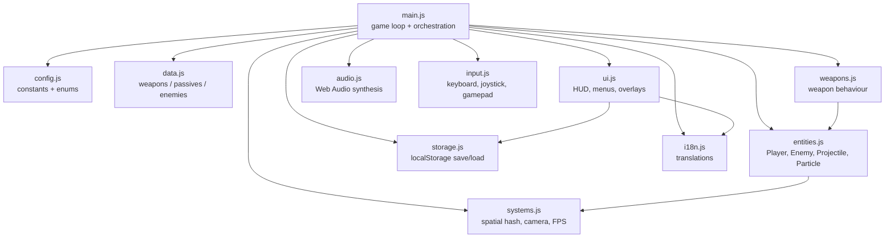

# Canvas Vampire Survivors

[](./LICENSE)
[](https://github.com/Ricardo-M-L/canvas-vampire-survivors/actions/workflows/ci.yml)
[](./CONTRIBUTING.md)
[](https://developer.mozilla.org/en-US/docs/Web/JavaScript)
[](./package.json)

> A zero-dependency HTML5 Canvas roguelite you can clone and play in 30 seconds.

## 📸 Demo


<sub>The image above is a placeholder. Drop a real capture into `docs/screenshot.png` and it will show up here.</sub>

## ✨ Features

- 🧩 **Modular ES-module architecture** — tiny, readable files under `src/`.
- 🎨 **HTML5 Canvas renderer** — fixed-step simulation, smooth 60+ fps.
- 🌐 **Built-in i18n** — English and 简体中文 out of the box, add more easily.
- 🎮 **Keyboard, touch joystick, and gamepad** input all supported.
- 📦 **Zero runtime dependencies** — no bundler, no build step, just open it.
- 💾 **Local save & settings** — persists via `localStorage`, no backend.
- ⚙️ **In-game settings panel** — volume, language, reduced motion.
- ♿ **Accessibility-aware** — respects `prefers-reduced-motion`, high-contrast HUD.
- 🧪 **Lint + format ready** — ESLint, Prettier, EditorConfig, CI on every PR.
- 🕹️ **Classic roguelite loop** — 7 weapons with evolutions, 10 passives,
  9 enemy archetypes, 2 bosses, wave director, and 12 achievements.

## 🎮 Controls

| Action          | Keyboard                 | Touch            | Gamepad            |
| --------------- | ------------------------ | ---------------- | ------------------ |
| Move            | `W` `A` `S` `D` / arrows | Virtual joystick | Left stick / D-pad |
| Pause           | `Esc` / `P`              | Pause button     | `Start`            |
| Confirm choice  | `Enter` / `Space`        | Tap option       | `A` / cross        |
| Cancel / back   | `Esc`                    | Back button      | `B` / circle       |
| Toggle settings | `,`                      | Gear icon        | `Select`           |
| Toggle language | `L`                      | Settings → Lang  | Settings → Lang    |

## 🚀 Quickstart

```bash
git clone https://github.com/Ricardo-M-L/canvas-vampire-survivors.git
cd canvas-vampire-survivors
npm install     # installs ESLint + Prettier only (dev deps)
npm start       # http://localhost:3000
```

Prefer no Node? Just open `index.html` directly in any modern browser, or
serve the folder with `python -m http.server`.

## 🌐 Play Online

An always-up-to-date build ships from `main` to GitHub Pages:

- **Live demo**: <https://ricardo-m-l.github.io/canvas-vampire-survivors/>

<sub>If the link 404s, the Pages deployment workflow needs to be enabled once in the repository settings.</sub>

## 🏗️ Architecture

The runtime is a single `main.js` orchestrator that wires together focused
modules. Every module has a clear job, and there are no runtime dependencies.



## 🆕 What's new in v2.1

- 🌊 **Wave director** — 10 named waves with shifting enemy pools.
- 👾 **5 new enemy archetypes** on top of the chasers: ranged cultists,
  splitting slimes, dasher wolves, shielded golems, ghost rushers.
- 👑 **Two bosses** at 5:00 (The Reaper) and 10:00 (Void Lord) with signature
  abilities (summon adds, telecharge).
- ⚔️ **Six weapon families with level-5 evolutions** (orbit, mine, lightning,
  knife, magic wand, whip). Plus the Garlic aura for cosiness.
- 🏆 **Leaderboard + achievements** — top-10 run table, 12 built-in
  achievements, toast pop-ups, and starter-weapon unlocks tied to milestones.
- 🧃 **Effects layer** — ring pulses on level-up, boss-spawn screen flashes,
  crit floating numbers, hit bursts. All capped for 60 fps.
- 🎵 **Procedural music upgrade** — minor arpeggiator over a walking chord
  progression, toggleable from settings.
- 📱 **Tighter mobile feel** — joystick dead-zone + sensitivity curve,
  edge double-tap to pause.
- 🎨 **High-contrast / colorblind mode** in the settings panel.
- 📒 See [BALANCE.md](./BALANCE.md) for every tunable in one place.

## 🗺️ Roadmap

- [ ] Boss waves with unique behaviours and loot drops
- [ ] Map variants (ruins, crypt, forest) with distinct enemy pools
- [ ] Weapon evolution combinations
- [ ] Meta-progression: persistent unlocks between runs
- [ ] Additional languages (ES, JA, FR — PRs welcome)
- [ ] Optional WebGL renderer behind a feature flag
- [ ] Replay recording and share-to-clip

Vote on roadmap items by reacting to pinned issues. Want to own an item? Open
a discussion or drop a comment.

## 🤝 Contributing

Contributions are very welcome — see [CONTRIBUTING.md](./CONTRIBUTING.md) for
setup, ground rules, and the PR checklist. By participating you agree to the
[Code of Conduct](./CODE_OF_CONDUCT.md).

Security issues? Please read [SECURITY.md](./SECURITY.md) first — do **not**
open a public issue.

## 📜 License

Released under the [MIT License](./LICENSE). Use it, fork it, ship it.

## 🙏 Acknowledgements

- Inspired by [Vampire Survivors](https://poncle.itch.io/vampire-survivors) by
  Poncle — an absolute masterclass in tight, compulsive gameplay loops. This
  project is an independent homage, not affiliated with or endorsed by Poncle.
- Thanks to every contributor who has filed an issue, sent a PR, or translated
  a string.

---

## 中文 · 简介

一个受《吸血鬼幸存者》启发的开源网页版幸存者游戏，纯原生 JavaScript + HTML5
Canvas 实现，**零运行时依赖**。项目采用模块化结构（`src/`），内置中英双语，
支持键盘、触屏虚拟摇杆与手柄操作，自动保存进度与设置，适配移动端与桌面端。

- 🚀 一键启动：`npm install && npm start`，或直接用浏览器打开 `index.html`
- 🌐 在线试玩：<https://ricardo-m-l.github.io/canvas-vampire-survivors/>
- 🤝 欢迎贡献：查看 [CONTRIBUTING.md](./CONTRIBUTING.md)，我们对新手非常友好
- 📜 协议：MIT，随意 fork 和二次创作

如果喜欢这个项目，请点一个 ⭐ Star 支持一下！
