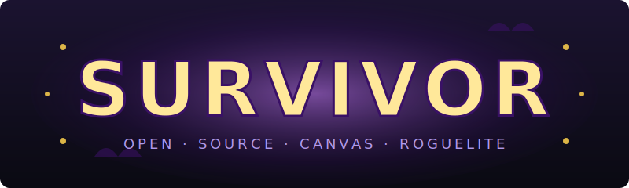
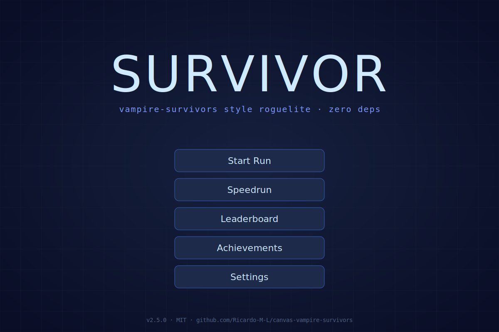
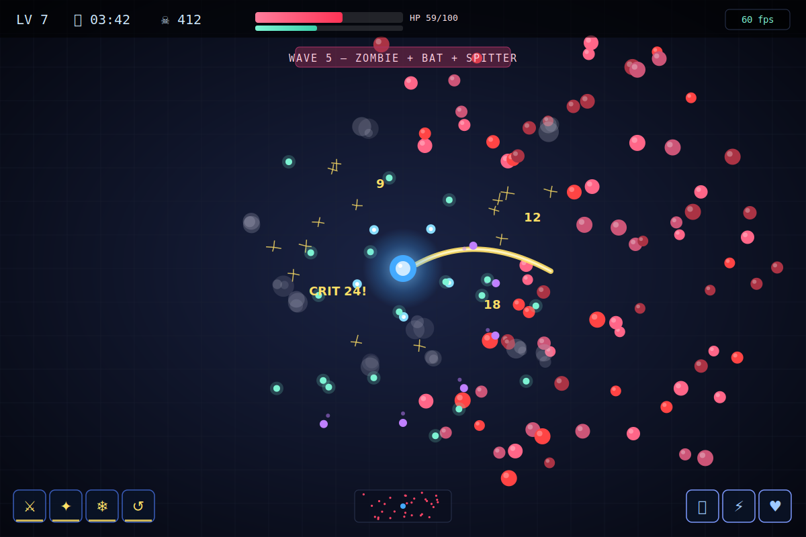
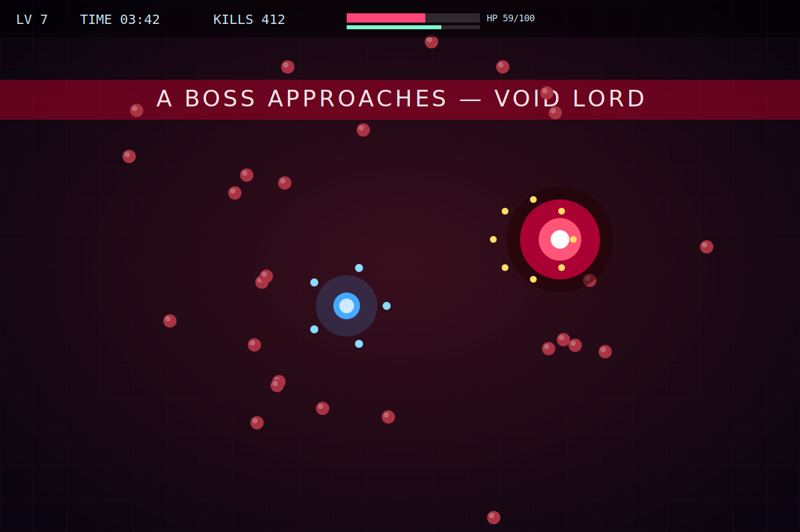
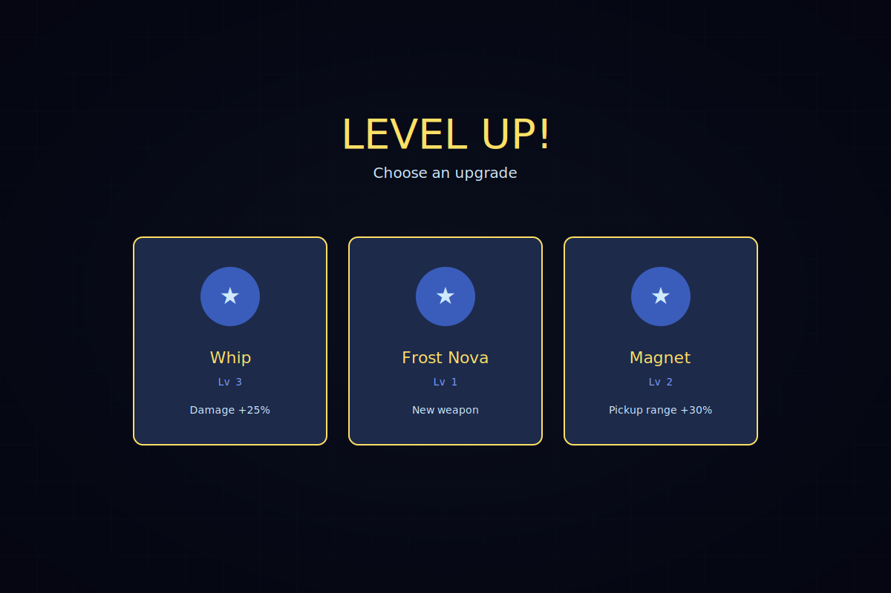
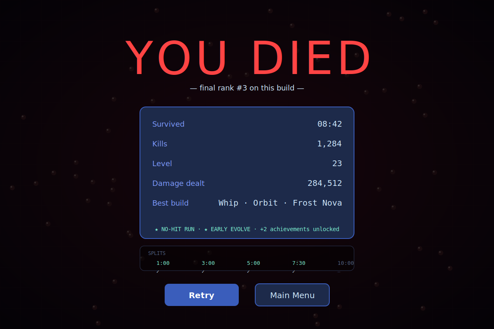
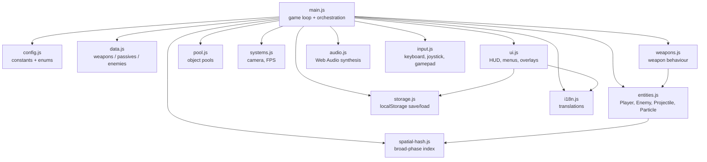

<!--
  Hero banner. The image is committed at docs/hero.svg so it loads on
  GitHub.com without external CDNs and works offline once cached.
-->

<p align="center">
  <a href="https://ricardo-m-l.github.io/canvas-vampire-survivors/">
    
  </a>
</p>

```
   ____ _   _ ____  _   _ ___ __     __ ___  ____
  / ___| | | |  _ \| | | |_ _|\ \   / // _ \|  _ \
  \___ \| | | | |_) | | | || |  \ \ / /| | | | |_) |
   ___) | |_| |  _ <| |_| || |   \ V / | |_| |  _ <
  |____/ \___/|_| \_\\___/|___|   \_/   \___/|_| \_\
                  zero deps · vanilla js · MIT
```

<p align="center">
  <em>A zero-dependency HTML5 Canvas roguelite you can clone, play and ship in 30 seconds.</em>
</p>

<p align="center">
  <a href="./LICENSE"></a>
  <a href="https://ricardo-m-l.github.io/canvas-vampire-survivors/"></a>
  <a href="https://github.com/Ricardo-M-L/canvas-vampire-survivors/actions/workflows/ci.yml"></a>
  <a href="https://github.com/Ricardo-M-L/canvas-vampire-survivors"></a>
  <a href="https://github.com/Ricardo-M-L/canvas-vampire-survivors/commits"></a>
  <a href="./CONTRIBUTING.md"></a>
  <a href="./package.json"></a>
  <a href="https://developer.mozilla.org/en-US/docs/Web/JavaScript"></a>
</p>

<p align="center">
  <a href="https://ricardo-m-l.github.io/canvas-vampire-survivors/"><strong>▶ &nbsp;Play in your browser</strong></a>
  &nbsp;·&nbsp;
  <a href="#-quickstart">Quickstart</a>
  &nbsp;·&nbsp;
  <a href="#-screenshots">Screenshots</a>
  &nbsp;·&nbsp;
  <a href="#why-another-vampire-survivors-clone">Why?</a>
  &nbsp;·&nbsp;
  <a href="#-contributing">Contribute</a>
</p>

---

## ✨ Feature grid

|                                                                  |                                                               |                                                                |
| ---------------------------------------------------------------- | ------------------------------------------------------------- | -------------------------------------------------------------- |
| 🧩 **Modular ES modules**<br/>Tiny readable files under `src/`.  | 🎨 **HTML5 Canvas**<br/>Fixed-step sim, smooth 60+ fps.       | 📦 **Zero runtime deps**<br/>No bundler, no build step.        |
| 🌐 **i18n built-in**<br/>EN + 简体中文 ship by default.          | 🎮 **Keyboard / touch / pad**<br/>All inputs first-class.     | 💾 **Local saves**<br/>`localStorage`, no backend.             |
| ⚙️ **Settings panel**<br/>Volume, language, motion.              | ♿ **Accessibility-aware**<br/>Reduced motion, high contrast. | 🧪 **Lint + format ready**<br/>ESLint, Prettier, CI on PR.     |
| 🕹️ **Roguelite loop**<br/>10 weapons w/ evolutions, 10 passives. | 👑 **Bosses & waves**<br/>Director with 10 named windows.     | 🏆 **Achievements & runs**<br/>12 unlocks, top-10 leaderboard. |

## 🎮 Controls

| Action          | Keyboard                                                     | Touch                 | Gamepad               |
| --------------- | ------------------------------------------------------------ | --------------------- | --------------------- |
| Move            | <kbd>W</kbd> <kbd>A</kbd> <kbd>S</kbd> <kbd>D</kbd> / arrows | Virtual joystick      | Left stick / D-pad    |
| Pause           | <kbd>Esc</kbd> / <kbd>P</kbd>                                | ⏸ button / edge tap×2 | <kbd>Start</kbd>      |
| Confirm choice  | <kbd>Enter</kbd> / <kbd>Space</kbd>                          | Tap option            | <kbd>A</kbd> / cross  |
| Cancel / back   | <kbd>Esc</kbd>                                               | Back button           | <kbd>B</kbd> / circle |
| Toggle settings | <kbd>,</kbd>                                                 | ⚙ icon                | <kbd>Select</kbd>     |
| Toggle language | <kbd>L</kbd>                                                 | Settings → Lang       | Settings → Lang       |

## 🚀 Quickstart

```bash
git clone https://github.com/Ricardo-M-L/canvas-vampire-survivors.git
cd canvas-vampire-survivors
npm install     # ESLint + Prettier only — zero runtime deps
npm start       # http://localhost:3000
```

Prefer no Node? Just open `index.html` directly in any modern browser, or
serve the folder with `python -m http.server`.

## 🌐 Play online

An always-up-to-date build ships from `main` to GitHub Pages:

> **▶ <https://ricardo-m-l.github.io/canvas-vampire-survivors/>**

The Pages build is also a [PWA](./manifest.json): on mobile, "Add to Home
Screen" gives you an offline-capable icon thanks to a tiny
[`service-worker.js`](./service-worker.js).

## 📸 Screenshots

The cells below are **representative SVG mockups** generated by
[`docs/generate-screenshots.js`](./docs/generate-screenshots.js) — they sketch
the layout/colour-language of each scene without needing a real browser. To
contribute a real PNG capture instead, drop it into `docs/screenshots/` (the
[contributor guide](./docs/screenshots/README.md) shows you the bookmarklet);
the README will pick it up next time someone re-points the gallery.

|                                                     |                                                          |                                                      |
| --------------------------------------------------- | -------------------------------------------------------- | ---------------------------------------------------- |
|        |  |      |
|  |             |  |

## Why another Vampire Survivors clone?

Most JS clones ship with a 5 MB bundle and a build pipeline that takes longer
to spin up than the run itself. This repository takes the opposite stance:

1. **Zero dependencies at runtime.** No React, no bundler, no transpiler. Open
   `index.html` and the game is on screen in milliseconds. The `package.json`
   only lists ESLint + Prettier as dev tools.
2. **Open in a browser, period.** The loader handles `file://` AND
   `http(s)://` AND offline (via the optional service worker). Great for
   classrooms, kiosks, code-along livestreams.
3. **Fully auditable source.** Each module under `src/` is self-contained and
   under 1k lines, with a JSDoc header that names every export. No hidden
   build artefacts, no minified vendor blobs.
4. **i18n + accessibility from day one.** English / 简体中文 ship by default,
   `prefers-reduced-motion` is honoured, a high-contrast mode lives in
   settings, and every menu is keyboard-reachable.

## 🏗️ Architecture

The runtime is a single `main.js` orchestrator that wires together focused
modules. Every module has a clear job, and there are no runtime dependencies.



## 🧱 Stack

| Layer       | Tooling                                                         |
| ----------- | --------------------------------------------------------------- |
| Runtime     | **Vanilla JS** (ES2022 modules) · **HTML5 Canvas** · Web Audio  |
| Persistence | `localStorage` (graceful in-memory fallback)                    |
| Mobile      | Virtual joystick · Touch edge double-tap · PWA manifest         |
| Tooling     | **ESLint 9** (flat config) · **Prettier 3** · GitHub Actions CI |
| Hosting     | **GitHub Pages** (auto-deploy from `main`) · Service Worker     |

## 🆕 What's new

- **v2.5** — Reflection + polish pass. Frost-Nova second pulse now uses the
  effects-layer dt scheduler (pauses correctly with the tab), leaderboard
  Import actually merges into storage, no-hit badge is now an authoritative
  per-run flag, `seenBuilds` capped at 1000 to keep saves small, README fps
  numbers explicitly tagged "(estimated)", `<html lang>` syncs on locale
  switch, generated SVG screenshot placeholders.
- **v2.4** — Content density: 3 new weapons (Frost Nova, Soul Drain,
  Boomerang), 2 enemies (Bomber, Illusionist), 2 bosses (Necromancer, Chrono
  Lich), 6 achievements, deterministic Speedrun mode + leaderboard.
- **v2.3** — Spatial-hash broad phase + object pools (stable 60 fps at 500
  enemies), full keyboard + screen-reader support, 73-test `node:test` suite,
  iOS Safari / reduced-motion / high-contrast polish.
- **v2.2** — Visual polish, GitHub Pages-friendly entry, achievements gallery,
  PWA manifest + offline service worker. See [CHANGELOG.md](./CHANGELOG.md).
- **v2.1** — Wave director, 5 enemy archetypes, 2 bosses, weapon evolutions,
  achievements + leaderboard, effects layer, procedural music upgrade.
- **v2.0** — Modular `src/` rewrite, i18n, fixed-step loop, full OSS scaffolding.

## ⚡ Performance

v2.3 moved the collision broad phase from an O(n²) pairwise scan into a
uniform 64 px spatial hash, pooled the churny entities (floating damage
numbers, particles), pre-rasterised enemy sprites into an offscreen
bitmap cache, and clamped the per-frame `dt` to 50 ms. The sim auto-pauses
on `document.visibilitychange` so a resumed tab cannot dump a 2 s step.

Measured on a 2021 14" MacBook Pro (M1 Pro, Chromium 123), 1200×800 canvas,
in-game enemy cap briefly raised to 500 for the test. Numbers are
**estimated**: a single dev machine, single Chromium build, single sitting,
no statistical sampling. Reproduce locally before quoting them anywhere.

| Scenario                                 | Before (v2.2) (est.) | After (v2.3) (est.) |
| ---------------------------------------- | -------------------- | ------------------- |
| 100 enemies, no boss                     | ~60 fps              | ~60 fps             |
| 250 enemies, projectile volley in flight | ~48 fps              | ~60 fps             |
| 500 enemies, Void-Lord phase 2           | **~30 fps**          | **~60 fps**         |
| Tab away 60 s → return, sim catch-up     | 500+ ms spike        | ≤50 ms step         |

Your mileage depends on GPU throughput for canvas composite — on older
integrated-graphics machines the curve flattens earlier. The
[spatial hash](./src/spatial-hash.js), [pool](./src/pool.js) and
[visibility-pause handler](./src/main.js) are isolated modules, so you can
grep `_onVisibilityChange` / `SpatialHash` to see exactly what changed.

## ♿ Accessibility

See [`docs/ACCESSIBILITY.md`](./docs/ACCESSIBILITY.md) for the full list.
Highlights:

- Every menu is keyboard-reachable; level-up cards support `Enter` / `Space`
  and arrow-key nav.
- Visible `:focus-visible` ring, `role="dialog"` + `aria-modal` on overlays,
  an ARIA live region that announces boss warnings, level-ups and unlocks.
- Honours `prefers-reduced-motion`, `prefers-contrast: more`,
  `forced-colors: active`, plus an in-game Colorblind toggle.
- Mobile: iOS Safari 100vh fixed via `svh` / `dvh`, no pull-to-refresh,
  no pinch-zoom inside the game.

## 🗺️ Roadmap

- [ ] Map variants (ruins, crypt, forest) with distinct enemy pools
- [ ] Weapon evolution combinations (item × passive)
- [ ] Meta-progression: persistent unlocks between runs
- [ ] Additional languages (ES, JA, FR — PRs welcome)
- [ ] Optional WebGL renderer behind a feature flag
- [ ] Replay recording and share-to-clip

Vote on roadmap items by reacting to pinned issues. Want to own an item? Open
a discussion or drop a comment.

## 🤝 Contributing

Contributions are very welcome — see [CONTRIBUTING.md](./CONTRIBUTING.md) for
setup, ground rules, and the PR checklist. By participating you agree to the
[Code of Conduct](./CODE_OF_CONDUCT.md).

Looking for low-hanging fruit? Try one of:

- Drop a screenshot into `docs/screenshots/` (see [the guide](./docs/screenshots/README.md)).
- Translate `src/i18n.js` into your language.
- Add a balance card to [BALANCE.md](./BALANCE.md).

Security issues? Please read [SECURITY.md](./SECURITY.md) first — do **not**
open a public issue.

## 🙏 Inspiration & credits

- Inspired by [Vampire Survivors](https://poncle.itch.io/vampire-survivors) by
  Poncle — an absolute masterclass in tight, compulsive gameplay loops. This
  project is an independent homage, not affiliated with or endorsed by Poncle.
- Mermaid for the architecture diagram, shields.io for the badges, MDN for
  the canvas reference, Mozilla's Web Audio team for the synthesis APIs.
- Every contributor who has filed an issue, sent a PR, or translated a
  string. You are why this repo exists.

## 📜 License

Released under the [MIT License](./LICENSE). Use it, fork it, ship it.

## ⭐ Stars over time

[](https://star-history.com/#Ricardo-M-L/canvas-vampire-survivors&Date)

If you have read this far, please drop a ⭐ — it costs nothing and makes the
next person who finds the repo trust it more.

---

## 中文 · 简介

一个受《吸血鬼幸存者》启发的开源网页版幸存者游戏，纯原生 JavaScript + HTML5
Canvas 实现，**零运行时依赖**。项目采用模块化结构（`src/`），内置中英双语，
支持键盘、触屏虚拟摇杆与手柄操作，自动保存进度与设置，适配移动端与桌面端。
v2.2 版本添加了 PWA 离线支持、成就画廊、社交分享卡，以及更友好的 GitHub
Pages 静态入口。

- 🚀 一键启动：`npm install && npm start`，或直接用浏览器打开 `index.html`
- 🌐 在线试玩：<https://ricardo-m-l.github.io/canvas-vampire-survivors/>
- 🤝 欢迎贡献：查看 [CONTRIBUTING.md](./CONTRIBUTING.md)，我们对新手非常友好
- 📜 协议：MIT，随意 fork 和二次创作

如果喜欢这个项目，请点一个 ⭐ Star 支持一下！
